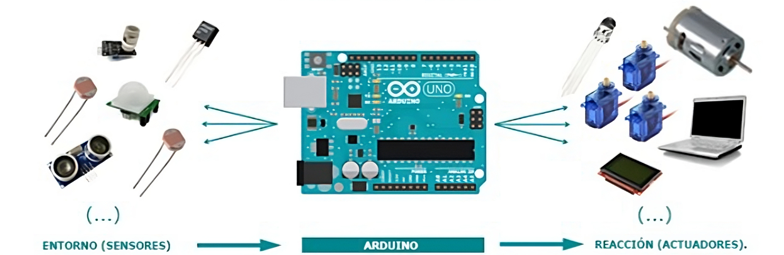

```{note}
Respecto al tema de sensores, acondicionmiento de señales y adquisicón, cabe resaltar que la descripción que se dará acá es más que todo informativa, ya que entrar en detalles más profundos requeriría un curso completo de electrónica. Afortunadamente, en terminos practicos, no es algo indispensable, ya que en el mercado existen módulos dedicados que integran sensores con electrónica que se encargan de acondicionar las señales hasta el punto que solo basta conectarlos adecuadamente a las tarjetas de adquisición para lograr un sistema funcional. No obstante, tener esta infromación sigue siendo importante al momento de elegir qué tipo de sensores y actuadores utilizar, así como aspectos de la programación para la recolección de la información.
```

# Sensores y señales
```{contents}
```
## Sensores
Un sensor es un dispositivo electrónico diseñado para detectar y responder a estímulos físicos o químicos del entorno, convirtiéndolos en señales eléctricas que pueden ser procesadas e interpretadas para dar cuenta de algún fénomeno. Los sensores desempeñan un papel fundamental en los sistemas de IoT, ya que permiten recolectar información del mundo físico y enviarla a los dispositivos para su posterior análisis y toma de decisiones.

Existen varios tipos de sensores, cada uno diseñado y optimizado para detectar algún tipo específico de estímulo que pueden varian tanto como fenomenos físicos, algunos ejemplos serían:

* **Sensores Acústicos:** Se basan en al medición de ondas, espectros y velocidades de onda.
* **Sensores Eléctricos:** Se basan en al medición de corrientes, carga, potenciales, campos eléctricos, permitividad y conductividad.
* **Sensores Magnéticos:** Se basan en al medición de campos magnéticos, flujos magnéticos y permeabilidad.
* **Sensores Térmicos:** Se basan en al medición de temperatura, calor específico y conductividad térmica.
* **Sensores Mecánicos:** Se basan en al medición de posición, aceleración, fuerza, presión, estrés, deformación, masa, densidad, momento, torque, forma, orientación, rugosidad, rigidez, complianza, cristalinidad y estructural.
* **Sensores Ópticos:** Se basan en al medición de intensidad lumínica, índice de refracción, reflectividad, absorción y emisividad.

En el mercado se encuentra disponible una amplia variedad de sensores para diferentes aplicaciones. Algunos ejemplos comunes incluyen termistores, termopares y sensores de semiconductor para la medición de temperatura; fotodiodos, fototransistores y sensores de luz ambiente para la detección de luz; sensores infrarrojos pasivos, acelerómetros y giroscopios para la detección de movimiento; sensores capacitivos o resistivos para la medición de humedad; sensores piezoeléctricos o capacitivos para la medición de presión; y sensores electroquímicos, infrarrojos o de semiconductor para la detección de gases. Estos son solo algunos ejemplos, pero existen muchos otros tipos de sensores para diferentes aplicaciones. Es importante tener en cuenta que las señales generadas por los sensores generalmente son analógicas, es decir, varían en forma continua (con cierta resolución y limitación referentes al ruido ambiental). Pero, como se menciono antes, lo que se requieren son señales digitales para su procesamiento. Por lo tanto, antes de que la señal llegue a la placa de adquisión es común utilizar circuitos de acondicionamiento y convertidores analógico-digitales (ADC) para transformar las señales analógicas en señales digitales comprensibles por el microcontrolador. Esto ultimo es de vital importancia y se describe a continuación.

```{note}
Si quiere aprender más sobre sensores y sus aplicaciones, puedes consultar los siguientes recursos:

1. Introducción a los sensores y transductores [link][1].
2. Tipos de sensores con sus diagramas de circuito [link][2].
```

## Señales
La señal física al ser capturada por un sensor sufre cierta degradación debido a factores intrínsecos como la resolución y el tiempo de respuesta del transductor utilizado. Esto, junto con el objetivo de proporcionar una señal lo más precisa posible al sistema de conversión analógico-digital, justifica la inclusión de una etapa de acondicionamiento de la señal ({ref}`Fig. 2 <acondicionamiento>`). Esta etapa tiene como finalidad mejorar la calidad de la señal, eliminar el ruido no deseado y adaptarla a los requisitos del sistema.

```{figure} ../_static/img/acondicionamineto.png
---
scale: 35%
name: acondicionamiento
---
imagen tomada y modificada de [link][3].
```

Posterior al acondicionamiento, el siguiente proceso que sufre la señal es la transformación de una señal analogíca a digital. 

### Conversión analago-digital (ADC)
La digitalización de señales se lleva a cabo mediante un dispositivo electrónico especializado que convierte una señal analógica continua en una señal digital compuesta por valores discretos que representan la información de la señal mediante valores numéricos (es conocido como un ADC por sus siglas en inglés). Este proceso se divide en cuatro etapas:

En la primera etapa, conocida como **muestreo**, se toman muestras periódicas de la amplitud de la onda para pasar de tener un conjunto continuo de valores a uno discreto ({ref}`Fig. 3 <muestreo>`). La frecuencia de muestreo debe cumplir con el teorema de [Nyquist-Shannon](https://es.wikipedia.org/wiki/Teorema_de_muestreo_de_Nyquist-Shannon) para evitar la pérdida de información.
```{figure} ../_static/img/muestreo.png
---
scale: 40%
name: muestreo
---
imagen tomada de "Sedra, A., *Microelectronic circuits*, Fifth Ed. 2004".
```

La siguiente etapa es la **retención**, donde las muestras tomadas se mantienen en un circuito especializado durante un tiempo suficiente para permitir su evaluación en términos de nivel (cuantificación). Aunque este proceso es necesario debido a limitaciones prácticas, no se considera en el análisis matemático y no cuenta con un modelo matemático específico.

```{figure} ../_static/img/ADC_esquema-3bits.png
---
scale: 40%
align: right
figclass: margin
name: ADC-flash-esquema
---
El digitalizador más simple conceptualmente - el ADC flash. Imagen tomada de [link](https://www.digikey.com/es/articles/match-the-right-adc-to-the-application)
```
En la etapa de **cuantificación**, se mide el nivel de voltaje de cada muestra y se asigna un rango de valores de la señal analizada a un único nivel de salida. Sin embargo, a partir de esta etapa, la transformación de la señal no puede ser invertida completamente debido a la pérdida de información inherente al redondeo, lo que se conoce como ruido de cuantificación. En terminos practicos, la asignación puede visualizarse a través de un circuito conceptual que ayuda a comprender el proeso ({ref}`Fig. 4 <ADC-flash-esquema>`).

```{figure} ../_static/img/cuantificacion.png
---
scale: 35%
name: cuantificacion
---
Representación gráfica de un proceso de cuantificación de 3 bits.
```

Finalmente, en la etapa de **codificación**, se traducen los valores obtenidos durante la cuantificación al código binario, lo que permite el procesamiento de la información. Está etapa se logra en la {ref}`Fig. 4 <ADC-flash-esquema>` gracias al modulo etiquetado como "Encoder". La codificación a binario no es un proceso muy complejo, para ilustrarlo tome como ejemplo el numero 6, si se quisiera llevar esto a la base binaria, se operaria obteniendo los residuos:

\begin{align*}
\text{LSB} \rightarrow \hspace{1cm}& r(\underbrace{\frac{6}{2}}_{\text{Cociente = 3}}) = 0, \\
 \hspace{1cm} & r(\underbrace{\frac{3}{2}}_{\text{Cociente = 1}}) = 1, \\
 \text{MSB} \rightarrow \hspace{1cm}& r(\underbrace{\frac{1}{2}}_{\text{Cociente = 0}}) = 1,\\
\end{align*}

Con esto, el numero 6 en represenación binaria resulta en **110**.

### Resolución
La resolución de un ADC hace referencia a la mínima escala de voltaje que es capaz de identificar el cuantificador. Claramente esto dependerá entonces de los voltajes de referencia y de la cantidad de bits que contiene el conversor (cuantos niveles hay disponibles). Si se toma un caso particular como el del Arduino, que usualmente cuenta con un ADC de  n=10 bits y unos voltajes de referencia de 0 - 5 V, se puede estimar la resolución del ADC como:

$$ R = \frac{\Delta V}{2^n} = \frac{5 V}{2^{10}} = 4.8 mV.$$

## Ejemplo: SENSOR LM35 - TEMPERATURA
Este ejemplo ilustra la importancia del acondicionamiento de una señal para aprovechar al máximo las características del sistema de adquisición.
```{figure} ../_static/img/lm35.png
---
scale: 30%
name: lm35
---
Configuraciones básicas de conexión del encapsulado. Tomado del datasheet del componente [link][4].
```
El LM35 es sensor encapsulado que proporciona una salida analógica (voltaje) proporcional a la temperatura a una relación de 10 mV por cada grado centígrado. En su configuración más sencilla ({ref}`Fig. 6 <lm35>`), la salida corresponde a: 0 V para 2 °C, y 1.48 V para 150 °C. Si suponemos que se está monitoreando un sistema físico cuya variación en temperatura va desde 15 °C a 40 °C, es fácil ver que sin una etapa de acondicionamiento se desaprovecha la resolución del ADC y se alcanza una resolución de medición del fenómeno de tan solo ~ 0.5 °C, lo cual puede no ser suficiente dependiendo de la aplicación, veamos:

Considerando que el LM35 sin acondicionamiento marcaría 0.13 V para 15 °C y 0.38 V para 40 °C, entonces el número de datos que se pueden distinguir en el rango de medida con el ADC de resolución R = 4.8 mV, sería:

$$N = \frac{0.38 - 0.13}{0.0048} = 52,$$

con esto, el ADC distingue 52 niveles en este rango, es decir, se tiene una resolución aproximada de 0.5 °C.

Sin embargo, añadiendo una etapa de acondicionamiento es posible mejorar la resolución. Basta con transformar la señal de tal forma que el rango 0.13 V - 0.38 V correspondan a 0 V - 5 V respectivamente, recuperando así las 1024 divisiones que nos proporciona el ADC y por tanto obteniendo una resolución de medición aproximada de 0.025 °C. Es fácil ver que la transformación a aplicar sería:

```{figure} ../_static/img/lm35-conversion.png
---
scale: 25%
name: lm35-conv
---
Tranformación, esto se puede lograr a través del uso de amplificadores operacionales [link][5].
```

```{note}
Si quieres aprender más sobre el procesamiento de señales, puedes consultar los siguientes recursos:

1. Adquirir una Señal Analógica: Ancho de Banda, Teorema de Muestreo de Nyquist y Aliasing. [link](https://www.ni.com/es-co/shop/data-acquisition/measurement-fundamentals-main-page/analog-fundamentals/acquiring-an-analog-signal--bandwidth--nyquist-sampling-theorem-.html)
2. Teledyne SP Devices, *The art of pulse detection*, 2018, [pdf](https://www.spdevices.com/documents/application-notes/73-pulse-detection-application-note/file).
```

[1]: <https://www.electronicshub.org/sensors-and-transducers-introduction/>
[2]: <https://www.elprocus.com/types-of-sensors-with-circuits/>
[3]: <https://es.wikipedia.org/wiki/Adquisici%C3%B3n_de_datos>
[4]: <https://www.ti.com/lit/ds/symlink/lm35.pdf>
[5]: <https://tallerelectronica.com/2018/01/04/configuraciones-basicas-de-amplificadores-operacionales/>