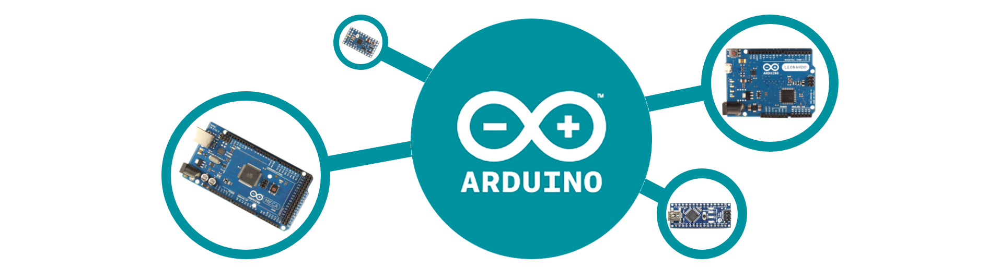

 

# Arduino
Arduino es una compañía que proporciona un ecosistema de desarrollo de sistemas electrónicos basados en microcontroladores que es multiplataforma, gratis y libre. Se puede decir que Arduino son 2 cosas:


**1. Una placa (PCB) de hardware libre**, diseñada para incorporar un microcontrolador reprogramable con una serie de entradas y salidas que permiten programar y conectar allí de forma muy sencilla y cómoda diferentes sensores y actuadores. Existen infinidad de modelos de placa Arduino, al ser de código abierto, diferentes versiones tan específicas como se deseen pueden ser adaptadas desde el diseño base. Sin embargo, la compañía produce una serie de placas oficiales entre las que se pueden distinguir: Arduino Uno, Arduino Mega, Arduino Nano, Arduino micro, entre otros. Estos llegan a diferir en forma y capacidades y versiones de microcontrolador que incorporan. De particular interés para este curso, es la versión Arduino Mega 2560.

```{figure} ../_static/img/Pinout-Mega2560rev3.png
---
scale: 40%
name: Fig8
---
Arduino Mega Pinout. Tomado del datasheet.
```

Este una placa de desarrollo que utiliza el microcontrolador ATmega2560 como base. Cuenta con una amplia variedad de características, incluyendo 54 entradas/salidas digitales (de las cuales 15 se pueden utilizar como salidas PWM), 16 entradas analógicas, 4 UARTs, un cristal de 16 MHz, conexión USB, un jack para alimentación DC, un conector ICSP y un botón de reseteo. Esta placa está equipada con un ADC de 10 bits.

```{admonition} Info
Las especificaciones completas del Arduino Mega 2560 se pueden consultar directamente en el datasheet que está en la pagina oficial [https://docs.arduino.cc/hardware/mega-2560][1].
```

**2. Un lenguaje de programación** provisto por la compañía para dotar al entorno con una sintaxis basada en C++ que proporciona diferentes comandos – asimismo llamados “órdenes” o “funciones” – que nos permiten especificar de una forma coherente y sin errores las instrucciones exactas que queremos programar en el microcontrolador de la placa. Arduino no es propiamente un lenguaje de programación, pero es común utilizar el termino en este contexto. Esta programación se puede llevar a cabo gracias a su entorno de desarrollo integrado (IDE) que ofrece las herramientas y funciones específicas para la programación de placas Arduino.

```{admonition} Info
El IDE se puede dercargar gratuitamente desde la pagina oficial [https://www.arduino.cc/en/software][2]. También puede encontrar la documentación para programar Arduino en su pagina oficial[https://www.arduino.cc/reference/en/][4].
```


```{note} 
Como una referencia rápida sobre la programación con Arduino puede revisar el siguiente cheat-sheet [link][3].
```
[1]: <https://docs.arduino.cc/hardware/mega-2560>
[2]: <https://www.arduino.cc/en/software>
[3]: <https://dtsanfer.files.wordpress.com/2018/07/acordeonarduino.pdf>
[4]: <https://www.arduino.cc/reference/en/>