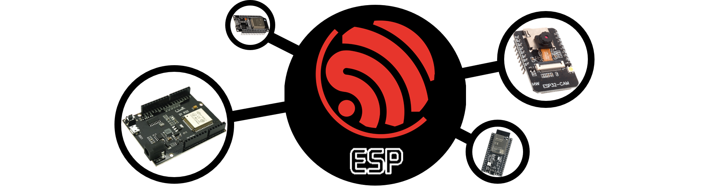

 

# ESP32
El ESP32 es un sistema embebido que combina las mejores características de las tarjetas de desarrollo basadas en microcontroladores, es decir, una amplia gama de periféricos integrados, como GPIO, UART, SPI, I2C, PWM y ADC, con un mayor poder de procesamiento gracias a que integra procesadores de doble núcleo basados en la arquitectura Xtensa LX6. Estos procesadores están especialmente diseñados para aplicaciones de IoT y ofrecen una velocidad de reloj de hasta 240 MHz. El ESP32 también cuenta con una unidad de procesamiento de señal digital (DSP) y una unidad de aceleración de cifrado, lo que le permite realizar tareas de procesamiento intensivas de manera eficiente. 

```{admonition} Info
Las especificaciones completas del ESP32 se pueden consultar directamente [https://www.espressif.com/sites/default/files/documentation/esp32_datasheet_en.pdf][1].
```

Técnicamente, el término "ESP32" se refiere al chip en sí. Sin embargo, como se pudó apreciar, también se utiliza para hacer referencia a las placas de desarrollo ESP32. Estas placas son altamente recomendadas debido a que trabajar directamente con los chips ESP32 no es fácil ni práctico, especialmente cuando se está aprendiendo, probando y creando prototipos. Al utilizar una placa de desarrollo, similar al enfoque de Arduino, se integra toda la circuitería necesaria para programar y utilizar el chip de manera más conveniente.

Para el desarrollo de aplicaciones, Espressif (sus fabricantes) proporciona un framework con recursos suficientes para trabajar de forma directa con Wi-Fi, Bluetooth, y para la fácil gestión de energía y varias otras características del sistema. Este se conoce como Espressif IDF (IoT Development Framework). Sin embargo, y una de las caracteristicas interezantes de estas tarjetas de desarrollo es que son **compatibles con el framwork de Arduino**, lo que facilita aun más la migración a este tipo de tecnologías. Al contar con un sistema de procesamiento más robusto, estás tarjetas incluso son compatibles con [MicroPython][2], una reimplementación de Python 3 diseñada específicamente para microcontroladores y sistemas embebidos.

Para poder usar las tarjetas ESP32 con el IDE de Arduino, se debe hacer la respectiva instalación de las tarjetas y librerias. Para ellos puede seguir alguna de las muchas guías que se encuentran en linea, por ejemplo [https://randomnerdtutorials.com/getting-started-with-esp32/][3].

```{note}
En línea se encuentran diferentes recursos para explorar mejor el uso de los dispositivos ESP32. Un punto de partida siempre será la documentación que provee el fabricante [link][4]
```

[1]: <https://www.espressif.com/sites/default/files/documentation/esp32_datasheet_en.pdf>
[2]: <https://randomnerdtutorials.com/getting-started-micropython-esp32-esp8266/>
[3]: <https://randomnerdtutorials.com/getting-started-with-esp32/>
[4]: <https://docs.espressif.com/projects/esp-idf/en/latest/esp32/get-started/> 